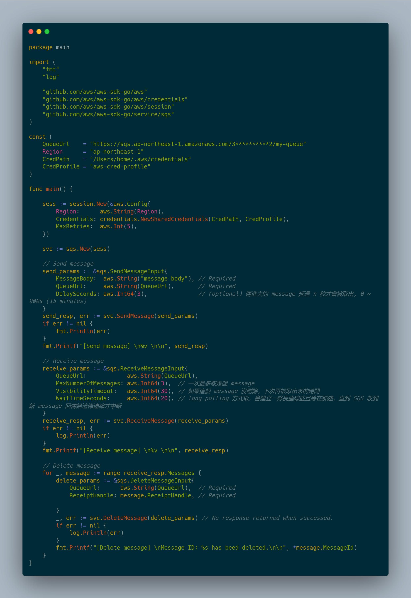
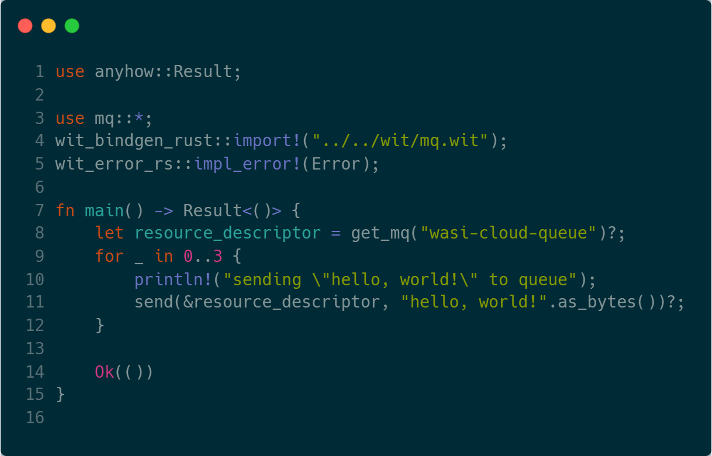

# SpiderLightning (or, `slight`)
SpiderLightning defines a set of WebAssembly Interface Types (i.e., WIT) files that abstract the cloud-provider specific knowledge required behind utilizing a Cloud serivce (e.g., key-value store, message queue, etc.).

In simple terms, SpiderLightning allows you to go:
<table>
<tr>
    <th>From this:</th>
    <th>To this:</th>
</tr>
<tr>
    <td></td>
    <td></td>
</tr>
</table>

## Repository Structure
- `/wit`: the SpiderLightning specification written in `*.wit` format (see [WIT](https://github.com/bytecodealliance/wit-bindgen/blob/main/WIT.md))
- `/src`: the SpiderLightning host cli (i.e., Slight)
- `/crates`: service implementations
- `/examples`: guest examples
- `/tests`: guest tests

## Looking for Contributors
Do you want to contribute to SpiderLightning's growth? 

Start with our <a href="https://github.com/deislabs/spiderlightning/blob/main/CONTRIBUTING.md">CONTRIBUTING.md</a>

## Build
- Run `make build`

## Run
- Run `make run`
