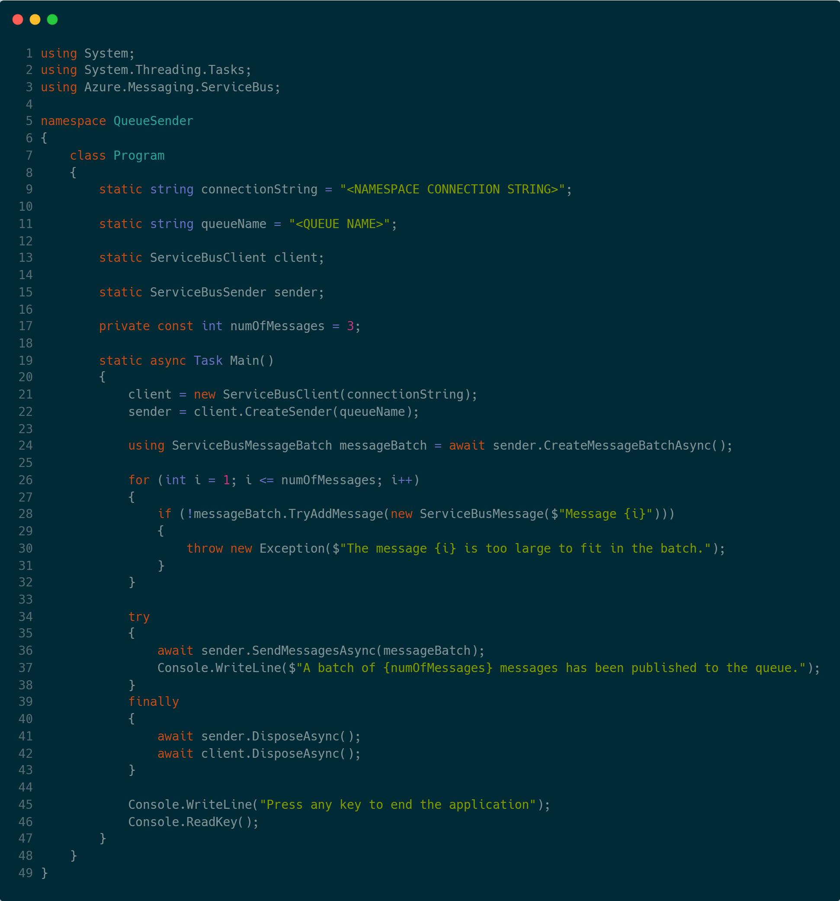

# SpiderLightning (or, `slight`)
SpiderLightning defines a set of [WebAssembly Interface Types](https://github.com/WebAssembly/interface-types/blob/main/proposals/interface-types/Explainer.md) (i.e., WIT) files that abstract distributed application capabilities, such as state management, pub/sub, event driven programming, and more.  

In simple terms, SpiderLightning allows you to go:
<table>
<tr>
    <th>From this:</th>
    <th>To this:</th>
</tr>
<tr>
    <td></td>
    <td></td>
</tr>
</table>


## Repository Structure
- `/wit`: the SpiderLightning specification written in `*.wit` format (see [WIT](https://github.com/bytecodealliance/wit-bindgen/blob/main/WIT.md))
- `/src`: the SpiderLightning host cli (i.e., Slight)
- `/crates`: service implementations
- `/examples`: guest examples
- `/tests`: guest tests

## Looking for Contributors
Do you want to contribute to SpiderLightning's growth? 

<p align="center">Start with our <a href="https://github.com/deislabs/spiderlightning/blob/main/CONTRIBUTING.md">CONTRIBUTING.md</a></p>

## Getting Started

```sh
$ git clone https://github.com/deislabs/spiderlightning.git && cd spiderlightning/ # clone our repo locally and go into it
$ make install-deps # installs the WASI-SDK
$ make build # builds SpiderLightning/Slight
$ make build-c # builds our c example
$ make run-c # runs our c example
```

> Note: There are also Rust examples that can be built (`build-rust`) and ran (`run-rust`). However, some of these examples have some dependencies on environment variables or local programs (e.g., `etcd`), so it probably won't work right off the gate like the C one did.


## FAQ

### What problems does SpiderLightning address?

SpiderLightning is a collection of common application interfaces exposed through WebAssembly intended to make cloud-native application development simpler. These interfaces are available to WebAssembly applications through the `slight` Command Line Interface (CLI) and host runtime that implements these interfaces using backing implementations of your choosing. For example, for the "message queue" interface, SpiderLightning may provide backends implemented by Azure Service Bus, Apache Kafka, and more.

SpiderLightning's interfaces offer developers a set of provider-agnostic APIs which enable developers to write portable applications without having to take direct dependencies on vendor specific APIs and SDKs.

Applications targeting SpiderLightning can leverage these interfaces to reduce the amount of code written to achieve tasks such as persisting key/values, participating in pub/sub, handling messages from a message queue, and much more. By reducing the code footprint, SpiderLightning also enables application binaries to be much smaller, often an order of magnitude smaller than similar container-based applications. This feature further increases the portability of applications to target constrained runtime environments like edge devices.

### What is the difference between SpiderLightning and WebAssembly System Interface (WASI)?

WASI's primary goal is to provide operating system abstractions for Wasm applications running outside of browser environments. SpiderLightning interfaces extend WASI to provide application capabilities, such as state management, event-driven patterns, and distributed locking. In the future, we hope that SpiderLightning's interfaces or interfaces that provide similar capabilities become part of WASI specification.

### What is the difference between SpiderLightning and Dapr?

SpiderLightning and Dapr share the same goal of providing capabilities to distributed applications, but each project's approach to achieving this goal is very different. For example, while Dapr runs as a sidecar container and provides an HTTP/gRPC interface for applications, SpiderLightning chooses not take a dependency on network transport protocols. Instead, `slight` links applications directly to generated WASM bindings, then executes them directly.

### Why the name "SpiderLightning"?


Spider Lightning is the name of a phenomenon of "long, horizontally travelling flashes often seen on the underside of [..] clouds" (source: [nssl](https://www.nssl.noaa.gov/education/svrwx101/lightning/types/#:~:text=Spider%20lightning%20refers%20to%20long,often%20linked%20to%20%2BCG%20flashes.)), pictured on the right. From that and from the fact we are developing SpiderLightning/`slight` based off of **Web**Assembly's lightning-fast technologies, the name fit.
