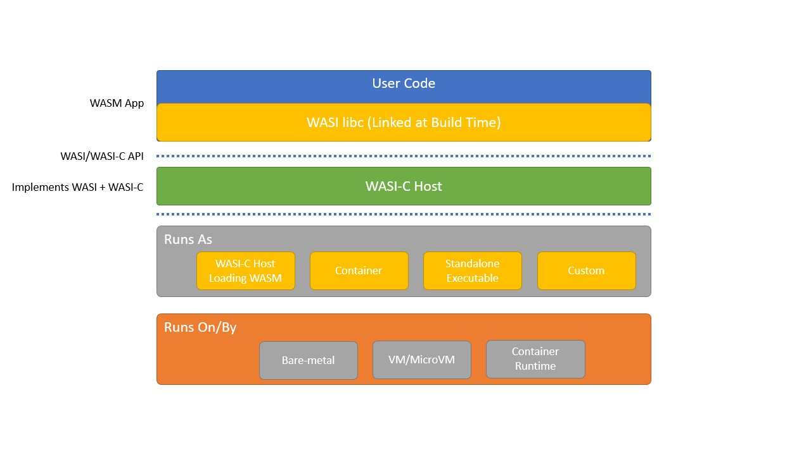

# SpiderLightning

SpiderLightning is a set of consistent, modular, and portable interfaces that provide common Cloud capabilities to WebAssembly applications. It is designed to follow the principals of the [WebAssembly System Interface](https://wasi.dev/):
1. **Portability**: SpiderLightning is vendor-neutral, and can run on various host environments (e.g., cloud, edge, bare-metal etc.) and deployment runtime (e.g., VM, containers, standalone etc.), using different programming languages (e.g., Rust, C etc.),
2. **Security**: applications that link to SpiderLightning will run in a sandboxed environment. The host will put capability functions in a sandboxed environment that the code can run, and
3. **Modular**.




## SpiderLightning capabilities

| Capability | Implemented Resource Examples | Future Resource Examples | Description | Work Status |
| - | - | - | - | - |
| distributed lock service | [etcd](https://etcd.io/) | [Apache Zookeeper](https://zookeeper.apache.org/) | / | ✅ `lockd.wit` |
| key-value store | Local Filesystem, [Azure Blob Storage](https://azure.microsoft.com/services/storage/blobs), [AWS DynamoDB](https://aws.amazon.com/dynamodb/), | [Redis](https://redis.io/), [Azure CosmosDB](https://azure.microsoft.com/en-us/services/cosmos-db/) | / | ✅ `kv.wit` |
| sql database | / | [MySQL](https://www.mysql.com/), [PostgresSQL](https://www.postgresql.org/) | / | ❌ TBD |
| message queue | Local Filesystem, [Azure Service Bus](https://azure.microsoft.com/services/service-bus/)| [Amazon SQS](https://aws.amazon.com/sqs/) | / | ✅ `mq.wit` |
| pub/sub | [Confluent Kafka](https://kafka.apache.org/) | [Amazon SNS](https://aws.amazon.com/sns/), [Azure Event Hubs](https://azure.microsoft.com/services/event-hubs/) | / | ✅ `pubsub.wit` |
| blob store | / | [Amazon S3](https://aws.amazon.com/s3/), [Azure Blob Storage](https://azure.microsoft.com/services/storage/blobs)| / | ❌ TBD |
| runtime config | Environment variables, [User secrets](https://docs.microsoft.com/en-us/aspnet/core/security/app-secrets?view=aspnetcore-6.0&tabs=windows) | [Azure App Configuration](https://docs.microsoft.com/en-us/azure/azure-app-configuration/), [AWS Parameter Store](https://docs.aws.amazon.com/systems-manager/latest/userguide/systems-manager-parameter-store.html) | / | ✅ `configs.wit` |
| HTTP Server | TBD | TBD | / | `http.wit` and `http-handler.wit` |
| gRPC Server | TBD | TBD | / | ❌ TBD |

### Capability Principles
As Spiderlightning is a set of interfaces, it is critical to have a certain criteria for including the right capabilities. We have selected the above capabilities based on the following criteria:

TODO

## WebAssembly Interface Types
SpiderLightning capability interfaces are written in WIT files. WIT is becoming the next standard for defining Wasm interfaces. WASI, for example, is transitioning to [use](https://github.com/bytecodealliance/wit-bindgen/blob/32e63116d469d8046727fae3c1333a7d35d0c5d3/tests/codegen/wasi-next/wasi_next.wit) this textual format, together with the [Interface Types](https://github.com/WebAssembly/interface-types/blob/main/proposals/interface-types/Explainer.md), and the [Canonical ABI](https://github.com/WebAssembly/interface-types/pull/140). 

Below is an example of a WIT file - defining a message queue capability.
```fsharp
// A Message Queue Interface
use { error, payload } from types
use * from resources

resource mq {
    // open message queue
    static open: func() -> expected<mq, error>

    // send a message to the queue
    send: func(msg: payload) -> expected<unit, error> 

    // receive a message from the queue
    receive: func() -> expected<payload, error>
}
```

[Bytecode Alliance](https://bytecodealliance.org/) has a project called [`wit-bindgen`](https://github.com/bytecodealliance/wit-bindgen) that will generate language bindings for WIT files. The bindings can be used to import or export the capability functions.

SpiderLightning heavily relies on `wit-bindgen` to generate Rust and C language bindings for importing and exporting capability functions. 

#### Limitations of `wit-bindgen`
As of now, wit-bindgen only support two guest programming languages: Rust and C. If we want to support other languages, we either need to use C FFI or write a language generator to wit-bindgen.

## Architecture

This project consists of three independent components.

#### Capability Interface in WIT

`wit/` contains the WIT files that define the capability interfaces. The WIT files are used to generate import functions for the application, and export functions for ths host implementation. The WIT files is the specification and our main focus for this project. 

#### Guest Implementation Examples

`examples/*` contains examples of guest implementations. They are used to demonstrate how to author a guest implementation.

#### Configuration

SpiderLightning applications can provide dynamic configuration manifest to configure the host what resources to provide. See [here](https://github.com/deislabs/spiderlightning/issues/23) for more details.


## Similar Projects
1. https://github.com/fermyon/wasi-experimental-toolkit
2. https://dapr.io/
3. https://github.com/mosn/layotto
4. https://github.com/google/go-cloud
5. https://libcloud.apache.org/
6. https://wasmcloud.dev/
