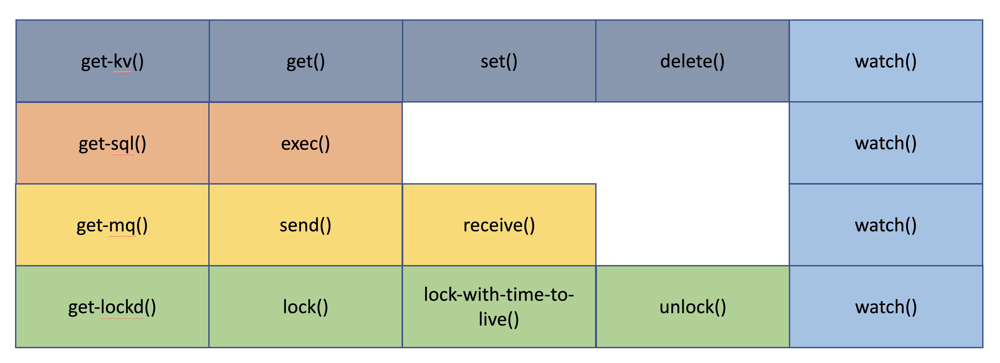

# wasi-cloud reactive programming

## Goal

Design a consistent interface that offers a reactive feature to cloud and distrbuted applications. The reactive feature should follow the [Reactive Principles](https://www.reactiveprinciples.org/principles/index.html). The reactive feature is about processing streams of events, where each event is an occurnace of change at a time within the system. 



### Design

Every supported providers, such as key-value store, sql databases, must implement a `watch` function to observe a stream of events, and emits change events to the events listeners. 

For example, updating a key in a key-value store emits an event, and it will generate a UpdateKey event to he host. 

Users could specify an event listener that listens to one or more streams of events, and decide whether or not to offload the execution logic to the application.

```rust
fn main() -> Result<()> {
    // executing in the guest
	  let rd = get_kv("my-container")?;
    
    let events = exec::Events::get()?;
    events
			.listen(watch(rd, "my-key1")?))?
			.listen(watch(rd, "my-key2")?))?
			.exec();
    Ok(())
}
```

The above example shows that the guest application can define a events resource and listen on streams of events that are observed by invoking `watch` functions on resource descriptors and keys to watch on. 

The `events::exec()` function will trigger the host to handle the incoming stream of events.  

```fsharp
use { observable } from resources
use { error } from errors

resource events {
	static get: function() -> expected<events, error>
	listen: function(ob: observable) -> expected<events, error>
	exec: function(duration: u64) -> expected<unit, error>
}
```

### How does the guest react to change events?

The guest will implement the `event-handler.wit` interface to provide a handle function. In host’s `events::exec()` function, the host will pass the change event to guest’s event handle function to process. 

```fsharp
use { event } from types

handle-event: function(ev: event) -> expected<option<event>, string>
```

```rust
pub struct EventHandler {}
impl event_handler::EventHandler for EventHandler {
    fn handle_event(ev: event_handler::Event,) -> Result<Option<event_handler::Event>,Error> {
        println!("{:?}", ev.source);
        println!("{:?}", ev.event_type);
        Ok(Some(ev))
    }
}
```

So if we put the main function and handle_event function together, we have this complete guest program. 

```rust
use anyhow::Result;

wit_bindgen_rust::import!("../events.wit");
wit_bindgen_rust::import!("../kv.wit");
wit_bindgen_rust::export!("../event-handler.wit");
wit_error_rs::impl_error!(exec::Error);

fn main() -> Result<()> {
    // executing in the guest
	  let rd = get_kv("my-container")?;
    
    let events = events::Events::get()?;
    events
			.listen(watch(rd, "my-key1")?))?
			.listen(watch(rd, "my-key2")?))?
			.exec();
    Ok(())
}

pub struct EventHandler {}

impl event_handler::EventHandler for EventHandler {
    fn event_handler(event: String) -> String {
        let s = format!("this event {} has been handled", event);
        println!("{}", s);
        s
    }
}
```

## Implementation

### Wit does not have higher-order functions, how can I implement callbacks?

```fsharp
event_handle: function(callback: function(event: string) -> string) -> expected<unit, error>
```

The above callback function as a argument to event_handle function is not a correct WIT syntax, as it does not design higher order functions. In ordre to fully materialize the reactive programming in wasi-cloud, given the constraints of WIT, I started to experiment my own implementation of callbacks in a repo called [wasi-callback](https://github.com/Mossaka/wasi-callback) 

I avoided directly introducing higher order functions to `wit-bindgen` as I am not familiar with how it generates code and the thoughts the authors put to reject this idea. 

In [the initial iteration](https://github.com/Mossaka/wasi-callback/commit/7c8298f3f28fcd8d4fc1b7c031bebc2d3d76bdc0) of wasi-callback, I want to make the following guest module working

```rust
wit_bindgen_rust::import!("../exec.wit");
wit_bindgen_rust::export!("../event-handler.wit");

fn main() {
    println!("executing in the guest...");
    exec::exec();
    println!("finishing in the guest...")
}

pub struct EventHandler {}

impl event_handler::EventHandler for EventHandler {
    fn event_handler(event: String) -> String {
        let s = format!("this event {} has been handled", event);
        println!("{}", s);
        s
    }
}
```

The exec function, which imports from the host, will call back to event_handler function, implemented in the guest. 

The difficult of doing this with `wit-bindgen` is that it does not generate code that allow me to have access to `wasmtime::Store`, which is a collection of WebAssembly instances and host-defined state. 

This means that in the host, the `main()` function in the guest is taking the mutable reference of `wasmtime::Store` for the entire duration of running the instance. But I also want the host, in the middle of the execution, invoke the `event_handler` function with the same Store. 

This is strictly prohibited in Rust because I am taking two mutable references to the same data structure and Rust does not know they have a causal relation.

I then gave up using `wit_bindgen_wasmtime::export!("exec.wit");` in the host. 

In [the second iteration](https://github.com/Mossaka/wasi-callback/pull/1/files#diff-42cb6807ad74b3e201c5a7ca98b911c5fa08380e942be6e4ac5807f8377f87fc), I copied the generated `[bindings.rs](http://bindings.rs)` to the src folder, and modified the generated APIs in this file to suit my needs. Specifically, I made the API to use reference counting to access host states, and thus I can have two mutable references to the same data structure.

```rust
linker.func_wrap(
    "exec",
    "events::exec",
    move |mut caller: wasmtime::Caller<'_, Context>, arg0: i32| {
        let store = caller.as_context();
        let handler = store.data().host.0.as_ref().unwrap();
        let _res = handler
            .clone()
            .lock()
            .unwrap()
            .event_handler(caller.as_context_mut(), "event-a");
        Ok(())
    },
)?;
```

 What does `store.data().host` look like?

```rust
let handler = EventHandler::new(&mut store, &instance, |cx: &mut Context| &mut cx.guest)?;
store.data_mut().host = (
    Some(Arc::new(Mutex::new(handler))), // guest function
    Some(Arc::new(Mutex::new(ExecTables::default()))), // table for looking up `self`
);
```

### Threading

In the reactive design, I want events to expose an API to resources so that each resource can implement their own listen for change code, and send event back to a channel. 

For example, the filesystem-key-value resource implements a `watch` function as the following

```rust
fn watch(&mut self, rd: &str, key: &str, sender: Sender<Event>) -> Result<()> {
    let base = self.get_base(rd)?;
    let (tx, rx) = channel();
    let mut watcher = watcher(tx, Duration::from_millis(100)).unwrap();
    watcher
        .watch(path(key, &base), RecursiveMode::Recursive)
        .unwrap();
    match rx.recv() {
        Ok(event) => {
            let data = format!("{event:#?}");
            let event = Event::new(
                "filekv".to_string(),
                "changed".to_string(),
                "1".to_string(),
                "id".to_string(),
                Some(data),
            );
            sender.send(event).unwrap();
        }
        Err(e) => bail!(e),
    }
    Ok(())
}
```

The host will iterate through all the observables, and for each observable, create a channel, and invoke that obserable’s watch function with the sender. And spawn threads to receive messages from these channels

```rust
fn events_exec(&mut self, _events: &Self::Events, duration: u64) -> Result<(), EventError> {
    // loop until duration time has passed
    let mut duration = duration;
    for ob in observables {
        // check if observable has changed
        let mut map = self
            .resource_map
            .as_mut()
            .ok_or_else(|| anyhow::anyhow!("resource map is not initialized"))?
            .lock()
            .unwrap();
        let resource = &mut map.get_dynamic_mut(&ob.rd)?.0;
        resource.watch(&ob.rd, &ob.key, ob.sender.clone())?;
    }
    let thread_handles = vec![];
    for ob in &self.observables {
        let handler = //get handler
        let store = //get store
        thread_handles.push(thread::spawn(move || {
            match ob
                .receiver
                .recv_deadline(Instant::now() + Duration::from_secs(duration))
            {
                Ok(event) => {
                    let event_param = EventParam {
                        specversion: event.specversion.as_str(),
                        event_type: event.event_type.as_str(),
                        source: event.source.as_str(),
                        id: event.id.as_str(),
                        data: event.data.as_deref(),
                    };
                    let _res = handler
                        .lock()
                        .unwrap()
                        .handle_event(store.deref_mut(), event_param)
                }
                Err(_) => return Ok(()),
            }
        }));
    }
    for handle in thread_handles {
        handle.join().unwrap();
    }
    Ok(())
}
```

So in the host `exec` function, I will use `thread::spawn` to spawn a new thread to handle the channels. However, this raises another question, thread requires the caller to have a static lifetime, but I know that the caller will give up after exiting the funciton, becuase I am using the same caller for the `main()` function as well as the `handle_event` function. 

I then realized I can’t treat both main() and handle_event as the same wasm instances anymore. In the next iteration, I used two different stores, linkers to instantiate the same module, but with different purposes. The first store and linker are used to execute the `main()` function, and the second pair is used to exec handler function.

```rust
let (mut store, instance) = wasmtime_init(&engine, ctx, path)?;
let (mut store2, instance2) = wasmtime_init(&engine, ctx2, path)?;

// put dummy implementation to these import functions
let handler = EventHandler::new(&mut store2, &instance2, |cx: &mut GuestContext| {
    &mut cx.guest
})?;
//
// ommit details
//
instance
    .get_typed_func::<(), (), _>(&mut store, "_start")?
    .call(&mut store, ())?;
```

### vtable for the handle functions?

```rust
wit_bindgen_rust::import!("../exec.wit");
wit_bindgen_rust::export!("../event-handler.wit");

fn main() {
    println!("executing in the guest...");
	  let events = events.listen(watch(kv, "key1"));
		for item in streams {
       
    }  
    println!("finishing in the guest...")
}

pub struct EventHandler {}

impl event_handler::EventHandler for EventHandler {
    fn event_handler(event: String) -> String {
        let s = format!("this event {} has been handled", event);
        println!("{}", s);
        s
    }
}
```

In the above guest program, there is one and only one, global, handle-everything function. This design has one big downside - the function needs to implement parsing logic to match different types of event. 

It would be great to have multiple handle functions. Each time, the user wants to add a new handle function, they can define them in the `event-handler.wit` interface, and then implement the functions in the program. 

```rust
event-handler1: function(event: string) -> string
event-handler2: function(event: string) -> string
event-handler3: function(event: string) -> string
```

```rust
fn main() {
    println!("executing in the guest...");
    exec::exec("event_handler1", "event-1");
    exec::exec("event_handler2", "event-2");
    exec::exec("sdfsdf", "event-3");
    println!("finishing in the guest...")
}

pub struct EventHandler {}

impl event_handler::EventHandler for EventHandler {
    fn event_handler1(event: String) -> String {
        let s = format!("this event {} has been handled", event);
        println!("{}", s);
        s
    }
    fn event_handler2(event: String) -> String {
        let s = format!("this event {} has been handled", event);
        println!("{}", s);
        s
    }
    fn event_handler3(event: String) -> String {
        let s = format!("this event {} has been handled", event);
        println!("{}", s);
        s
    }
}
```

How are we going to register them?

Is the event_handler function signature fixed?

How does the host maintain these functions?