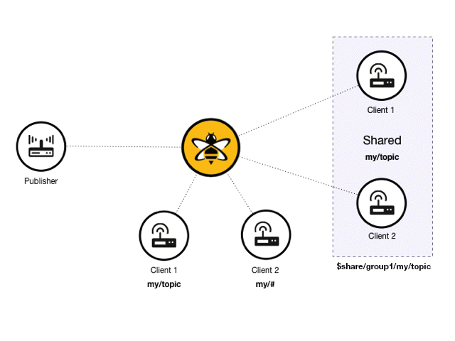

# `pubsub` + `message-queue` Interface Proposal
**Made 2022-11-24 by [danbugs](https://github.com/danbugs)**

This document proposes a new interface for the `pubsub`, and `message-queue` capabilities together with highlighting the limitations of the current interfaces and proposing a solution.

##  1. <a name='TableofContents'></a>Table of Contents

<!-- vscode-markdown-toc -->
* 1. [Table of Contents](#TableofContents)
* 2. [Background](#Background)
	* 2.1. [`message-queue` Background](#message-queueBackground)
	* 2.2. [`pubsub` Background](#pubsubBackground)
	* 2.3. [`pubsub`/`message-queue` Comparison](#pubsubmessage-queueComparison)
* 3. [`pubsub`/`http` Interoptability](#pubsubhttpInteroptability)
* 4. [Problem Statement](#ProblemStatement)
* 5. [Proposal](#Proposal)
	* 5.1. [`pubsub` WIT](#pubsubWIT)
	* 5.2. [`slight` Runtime](#slightRuntime)
* 6. [Alternatives](#Alternatives)
	* 6.1. [Alternative 1](#Alternative1)
* 7. [Additional Details](#AdditionalDetails)

<!-- vscode-markdown-toc-config
	numbering=true
	autoSave=true
	/vscode-markdown-toc-config -->
<!-- /vscode-markdown-toc -->

##  2. <a name='Background'></a>Background

###  2.1. <a name='message-queueBackground'></a>`message-queue` Background

`message-queue`s are a messaging mechanism, where message transmitters send messages to a queue construct that can be read by receivers.


###  2.2. <a name='pubsubBackground'></a>`pubsub` Background

`pubsub` is a messaging pattern, where, instead of sending messages to specific receivers, publishers (i.e., message transmitters) send messages to a channel (or, topic). On the other end, subscribers (i.e., message receivers) can own a subscription to that channel, so they will receive whatever message is sent to it.


In addition, there are two ways to receive messages:
1. Pull-based: The subscriber pulls messages from the channel.
1. Push-based: The channel pushes messages to the subscriber.

Plus, `pubsub`s usually surface the idea of "Quality of Service" (QoS):
1. At most once: The message is delivered at most once, but could be lost.
1. At least once: The message delivery is guaranteed, but could be duplicated.
1. Exactly once: The message *pretty much* delivered once.

###  2.3. <a name='pubsubmessage-queueComparison'></a>`pubsub`/`message-queue` Comparison

Historically, `pubsub` services (i.e., implementers of the `pubsub` pattern)  are thought to be comprised of non-competitive consumers – That is, if a message is sent to a channel, every receiver that is subscribed to that channel will, eventually, receive it.

While, on the other hand, historically, `message-queue`s are thought to be comprised of competitive consumers – That is, a queued message is dequeued as soon as any one receiver has read it.

However, if we look at services that provide `message-queue` / `pubsub` implementations, the line between the two concepts becomes blurred.

That is, today's most used related services provide both `message-queue`, and `pubsub` capabilities. Below, is a visual example from [HiveMQ](https://www.hivemq.com/) displaying an event-driven architecture with both `message-queue`, and `pubsub` capabilities:


Source: [HiveMQ's Shared Subscriptions](https://www.hivemq.com/docs/hivemq/4.9/user-guide/shared-subscriptions.html)

##  3. <a name='pubsubhttpInteroptability'></a>`pubsub`/`http` Interoptability

`pubsub`s are often used in conjuction with `http` to send, and receive messages from subscribed topics. However, through experimentation on the intereoperability between the two services, it is impossible to use `slight`'s `http` service to correctly manage `pubsub` subscriptions. This is because the `http` interface cannot return a handle to the `pubsub` client under which the subscription was created - Hence, you can only receive messages from a subscribed topic if the subscriptions is done in conjunction with the message polling. This is a problem because message polling, and subscribing should be two separate concerns as, if you only subscribe to a topic at the time of polling, you will miss messages that were sent to the topic before you subscribed to it.

##  4. <a name='ProblemStatement'></a>Problem Statement

1. As one of SpiderLightning's core goals is to stray away from mirroring infrastructure and focus on concepts, we should unify the `pubsub`, and `message-queue` interfaces into the umbrella of the `pubsub` pattern.
1. The current `pubsub` interface is not well suited for event-driven architectures as:
	- the `payload` type is lacking, and
	- `http` interoptability is lacking - It should be modified to allow better subscription management.

##  5. <a name='Proposal'></a>Proposal

The change involves:
- unify `pub` and `sub` resources into a single `pubsub` resource,
- modify the `pubsub` interface to contain `message-queue` semantics,
- change the `payload` type to `event` (following the `CloudEvents` spec),
- remove the `subscribe` method from the `pubsub` interface to pass the responsibility of subscriptions to `slight` through information made available at compilation-time through the `slightfile`, and
- add the `unsubscribe` method to the `pubsub` interface.

###  5.1. <a name='pubsubWIT'></a>`pubsub` WIT

```wit
// A Pub/Sub Interface
use { error, event } from types

variant channel {
	queue(string),
	topic(string)
}

resource pubsub {
	// creates a handle to a pubsub object
	static open: func(name: string) -> expected<pubsub, error>

	// unsubscribes from a channel
	unsubscribe: func(location: channel) -> expected<unit, error>

	// publishes an event to a channel
	publish: func(message: event, location: channel) -> expected<unit, error> 

	// pull-based message delivery
	receive: func() -> expected<event, error>
}
```

###  5.2. <a name='slightRuntime'></a>`slight` Runtime

When detecting a capability in the `slightfile`, the `slight` runtime currently calls the `new` function for that respective capability. The `new` function for the `Pubsub` capability will be modified to create a client and subscribe to a topic or queue specified in the `slightfile`.

```toml
specversion = "0.2"

[[capability]]
resource = "pubsub.mosquitto"
name = "my-pubsub"
    [capability.configs]
    MOSQUITTO_HOST = "localhost"
    MOSQUITTO_PORT = "1884"
	SUBSCRIBE_TO = "my-subscription"
	CHANNEL_TYPE = "topic" # or "queue"
```

##  6. <a name='Alternatives'></a>Alternatives

###  6.1. <a name='Alternative1'></a>Alternative 1

When investigating a way to keep a hold of the client handle (with the purpose of mainting subscriptions) while interoping `pubsub` and `http`, I investigated the possibility utilizing persistent clients in brokers accessible through an ID, but this approach proved to be inconsistent across implementers.

##  7. <a name='AdditionalDetails'></a>Additional Details

- `push-based` message delivery is not included in this proposal, but would include the addition of a `on_message` callback to the `pubsub` interface.

```wit
// A Pub/Sub Handler Interface

use { error, event } from types

on-message: func(message: event) -> expected<unit, error>
```